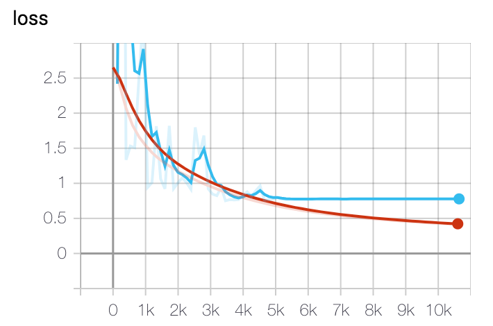
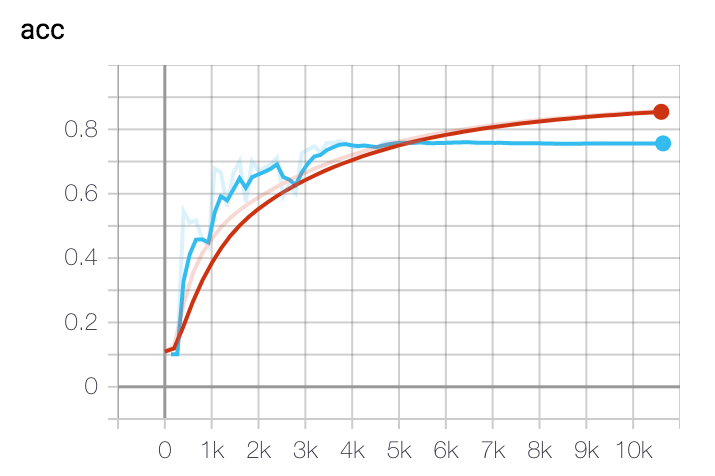

### Project Description

This is a test to classify 3D MNIST digits in Keras and Pytorch. The method uses a simple architecture consisting of two blocks of 3D convolutions/ReLU/BatchNorm followed by fully connected layers to downsample voxel grids to a lower dimension space.

#### Dataset

The [3D MNIST](https://www.kaggle.com/daavoo/3d-mnist) dataset is from Kaggle and the scripts use ```full_dataset_vectors.h5``` to create voxel grids of size (16, 16, 16, 3).

#### Model Architecture

```
----------------------------------------------------------------
        Layer (type)               Output Shape         Param #
================================================================
            Conv3d-1        [-1, 8, 16, 16, 16]             656
            Conv3d-2       [-1, 16, 16, 16, 16]           3,472
              ReLU-3       [-1, 16, 16, 16, 16]               0
       BatchNorm3d-4       [-1, 16, 16, 16, 16]              32
         MaxPool3d-5          [-1, 16, 8, 8, 8]               0
            Conv3d-6          [-1, 32, 8, 8, 8]          13,856
            Conv3d-7          [-1, 64, 8, 8, 8]          55,360
              ReLU-8          [-1, 64, 8, 8, 8]               0
       BatchNorm3d-9          [-1, 64, 8, 8, 8]             128
        MaxPool3d-10          [-1, 64, 4, 4, 4]               0
          Dropout-11          [-1, 64, 4, 4, 4]               0
           Linear-12                 [-1, 1024]       4,195,328
             ReLU-13                 [-1, 1024]               0
          Dropout-14                 [-1, 1024]               0
           Linear-15                   [-1, 10]          10,250
================================================================
Total params: 4,279,082
Trainable params: 4,279,082
Non-trainable params: 0
----------------------------------------------------------------
Input size (MB): 0.05
Forward/backward pass size (MB): 2.77
Params size (MB): 16.32
Estimated Total Size (MB): 19.14
----------------------------------------------------------------
```

#### Results
- Train and validation losses


- Train and validation accuracies


Observed from the plots above, the model has converged with an accuracy of **91%** on the training data and a validation accuracy of **78%**. Training was done over 80 epochs with a default learning rate of 1e-3 using an Adam optimizer and reduced by a factor of 0.5 on plateau every three epochs.

Test accuracy is **75%**.

#### Dependencies
- PyTorch 1.3.1
- Python 3.7